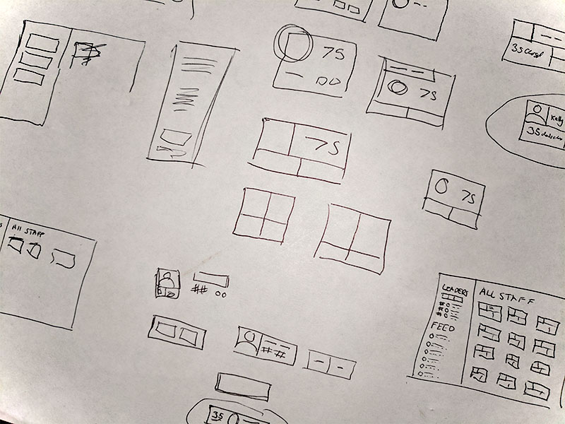

# Sales Dashboard
for Glengarry Glen Ross Inc.

> Always. Be. Closing.

This dashboard has been created to demonstrate my level of skill in fundamental front-end tools. No external libraries or frameworks have been used in the creation of this project, though I did employ a pre-processor for my Sass files.

## Getting Started
This project can run without any dependencies, locally on your computer.

1. Download the project
2. Unzip the project (if it is zipped)
3. Navigate to the /src directory
4. Open index.html in your browser

If you wish to view a hosted version of the site on the web, [the continuously deployed site can be found here](https://glengarry.netlify.app/src/index.html).

## Features
- Dark/Light theme with automatic detection
- Dynamic content, pulled from a data file
- Top Performer attribute, based on the data
- Functional sorting/ordering on lists
- Live sales feed with randomly generated data
- Device agnostic
- Early 90's inspiration

## Process
I began this project by first taking some time to familiarize myself with the provided markup. After I had an idea of what kinds of elements would be required, I began sketching some very rough wireframes.

Once I had a good idea of what structures would work, I moved into Illustrator, where I first mocked up a single card, and then extrapolated the design to the rest of the page.

Having a high-fidelity mock-up of the page means I can switch completely out of my design mindset and into development mode. (Switching back and forth can be taxing).

I completed all of the primary Javascript functionality before touching any CSS. Once element/list creation, sorting, and ordering were complete, I moved into styling. I knew I wanted dark/light themes, so I set that up early on, along with some foundational Sass files.

Once the design was completed, I went back into JS mode, and added the dynamic Sales Feed.

## Explanation of Design Decisions
### Changes to received markup
There were a few structural changes that I made to the HTML file I received. Most notably, I converted the table into an ordered list. Given that the data for each salesperson was very limited, a table seemed a bit too verbose.

Having each of the 3 sections as lists helped keep things semantic when sorting, and allowed for better use of space via the grid. If more salesperson data was available, a table might become the better option.

A few other minor modifications were made to the ordering and positioning of content, as well as some text changes.

### Why so much Javascript?
I'm guessing that the expectations for this project were primarily related to visual design, via HTML and CSS. Given the time I had, I thought it might be beneficial to display a more broad set of skills.

The dashboard provided the opportunity to exercise many different patterns, which I took as an invitation to practice and brush up on.

### Organization of Files
The method in which I implemented my Javascript files would not be considered best practice in a production environment. While I intended to use modules, they do not work when viewing a project locally.

Since I was avoiding any libraries or frameworks, I opted to use a faux module setup, with different functionality (files) being included directly within the HTML file.

This decision favors legibility and usability (for the reviewer) over real-world best practices that could not be applied here.

## Improvements TBD
1. I believe there is a more ideal way to implement the preferred color scheme of the browser. This was my first time developing a site with a theme toggle, and I know there's room for Improvement.
2. My wife says that the Ascending/Descending labels become confusing when switching from Name to Deals. To her, Deals + Ascending should list most deals first. I always get confused by list ordering (Asc vs Desc), and can imagine a better system that eschews that verbiage.

## Thanks
Thank you for viewing my project!
